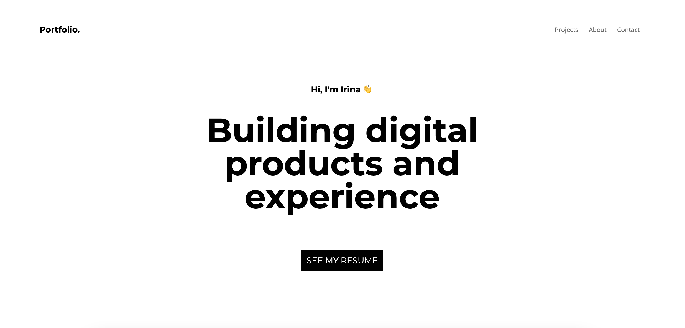

# Personal portfolio




View the **[live site](https://irinazay.github.io/portfolio/)**.

### For my personal portfolio I used this clean, beautiful, minimal and responsive portfolio template!


To get template, **[click here](https://github.com/chetanverma16/react-portfolio-template)**.

## How To Use 

From your command line, clone and run portfolio:

```bash
# Clone this repository
$ git clone https://github.com/irinazay/portfolio

# Go into the repository
$ cd portfolio

# Install dependencies
$ npm install

#Start's development server
$ npm start
```


## Technologies Used

- [React](https://reactjs.org/)
- [Gatsby](https://www.gatsbyjs.com/)


